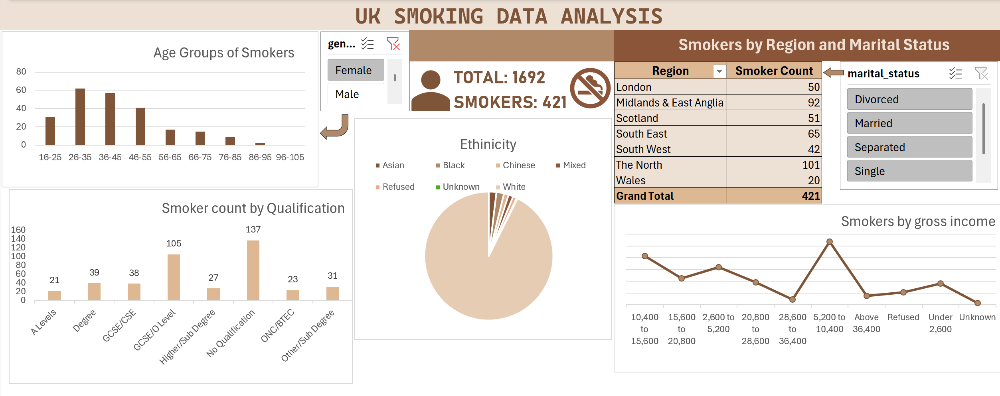

# UK_Smoking_Data_Analysis
This project analyses UK smoking trends using Excel, focusing on patterns across age, gender, region, and ethnicity. Key insights include higher smoking prevalence among people aged 16–90, regional variations, and correlations with marital statuses. The analysis is visualized through a dashboard screenshot.

---

## 📊 Dashboard Screenshot

---

## 📋 Sample Data Table
Here’s a snapshot of the dataset in Excel:

| Gender | Age | Marital Status | Highest Qualification | Nationality | Ethnicity | Gross Income       | Region    | Smoke |
|--------|-----|----------------|---------------------|------------|-----------|-----------------|-----------|-------|
| Male   | 38  | Divorced       | No Qualification    | British    | White     | 2,600 to 5,200   | The North | No    |
| Female | 42  | Single         | No Qualification    | British    | White     | Under 2,600      | The North | Yes   |
| Male   | 40  | Married        | Degree              | English    | White     | 28,600 to 36,400 | The North | No    |
| Female | 40  | Married        | Degree              | English    | White     | 10,400 to 15,600 | The North | No    |
| Female | 39  | Married        | GCSE/O Level        | British    | White     | 2,600 to 5,200   | The North | No    |
| Female | 37  | Married        | GCSE/O Level        | British    | White     | 15,600 to 20,800 | The North | No    |
| Male   | 53  | Married        | Degree              | British    | White     | Above 36,400     | The North | Yes   |

> *Note: This is just a sample; full data is available in [UK_Smoking_Data_Analysis.xlsx](UK_Smoking_Data_Analysis.xlsx) .*

---

## 💡 Key Insights
- Higher smoking prevalence among **males and females aged 16–90**  
- Differences in smoking rates across **ethnic groups**  
- Regional trends show **differences among marital statuses** over time  
- Correlations between smoking and gross incomes are observable  

---
## 📂 Dataset
Download the dataset: [UK_Smoking_Data_Analysis.xlsx](UK_Smoking_Data_Analysis.xlsx) 

---

## 🚀 How to Explore
1. Download the given excel file
2. Open the Excel file in Microsoft Excel (or any compatible program like LibreOffice or Google Sheets).
3. Explore the data and view the raw dataset in the Excel sheet.
4. Examine pivot tables, charts, and calculations used in the dashboard.
5. Analyze or modify
